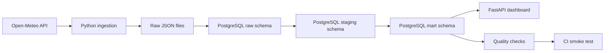
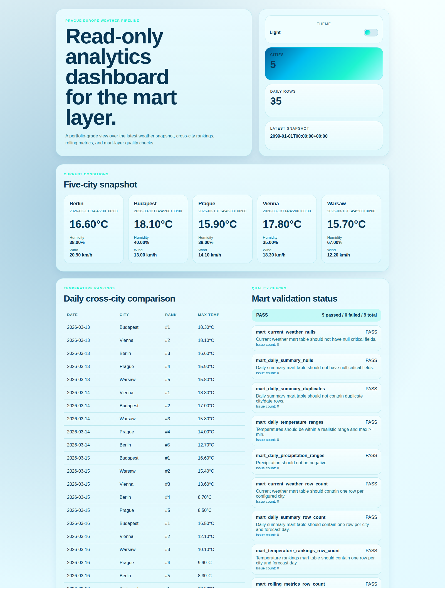
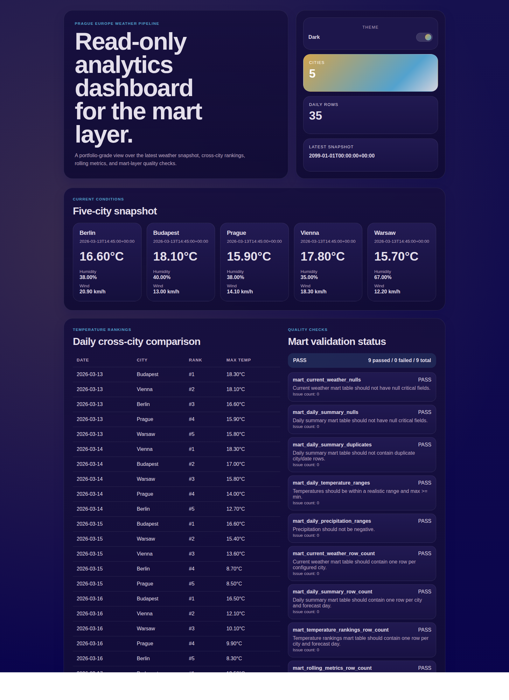

# Prague Europe Weather Pipeline

An end-to-end data engineering portfolio project that ingests public weather
data for Prague and selected European cities, stores raw payloads, builds
layered PostgreSQL models, validates the mart layer, and exposes the results
through a read-only analytics dashboard.

## Why this project exists
This repository is designed to demonstrate practical data engineering
fundamentals in a form that is easy to run locally and easy to review on
GitHub:
- ingestion from a public API
- reproducible raw storage
- SQL-first transformations
- layered data modeling
- data quality validation
- local developer workflow
- lightweight product-facing presentation via UI

## Architecture


## Tech stack
- Python 3.11+
- PostgreSQL 16
- Docker Compose
- FastAPI + Jinja
- `requests`
- `psycopg`
- `pytest`, `ruff`, `black`
- GitHub Actions

## Data layers
- `raw`: original API payloads plus ingestion metadata
- `staging`: flattened, typed current and daily records
- `mart`: latest analytical snapshot for dashboarding and SQL querying

Important behavior:
- `raw` and `staging` keep historical runs
- `mart` is rebuilt as a latest-snapshot analytical layer
- rerunning ingestion increases historical raw and staging counts, but mart
  remains one current analytical view per city and forecast date

## Quickstart
```bash
make venv
source .venv/bin/activate
make install
make install-cli
prague-weather init
prague-weather check
prague-weather ui
```

`make install-cli` creates `~/.local/bin/prague-weather` so the command works from any terminal, not only from the repository folder.

Open the dashboard:

```text
http://127.0.0.1:8000
```

If port `8000` is already in use:

```bash
prague-weather ui --port 8010
```

Repo-local alternatives still work:

```bash
make init
make check
make ui
```

## Global CLI workflow
```bash
prague-weather init
prague-weather check
prague-weather dq
prague-weather ui
```

## Repo-local make workflow
```bash
make up
make wait
make init
make check
make dq
make ui
```

Alias meanings:
- `prague-weather init` -> full local pipeline refresh from any terminal
- `prague-weather check` -> lint + unit tests from any terminal
- `prague-weather dq` -> mart-layer quality checks from any terminal
- `prague-weather ui` -> start the read-only dashboard from any terminal
- `make init` -> full local pipeline refresh
- `make check` -> lint + unit tests
- `make dq` -> mart-layer quality checks
- `make ui` -> start the read-only dashboard

## Sample workflow
1. Start or refresh the local pipeline with `prague-weather init`
2. Inspect mart-layer analytics in the browser with `prague-weather ui`
3. Validate code quality with `prague-weather check`
4. Run deterministic database validation with `prague-weather smoke`

## Example SQL queries
```sql
SELECT city, current_time_utc, temperature_c
FROM mart.city_current_weather
ORDER BY city;
```

```sql
SELECT forecast_date, city, max_temperature_rank, temperature_max_c
FROM mart.daily_temperature_rankings
ORDER BY forecast_date, max_temperature_rank, city;
```

```sql
SELECT city, forecast_date, rolling_3day_avg_temp_c, rolling_3day_precip_mm
FROM mart.city_rolling_3day_metrics
ORDER BY city, forecast_date;
```

## Expected mart row counts
After a successful run:
- `mart.city_current_weather`: `5`
- `mart.daily_city_weather_summary`: `35`
- `mart.daily_temperature_rankings`: `35`
- `mart.city_rolling_3day_metrics`: `35`

## Dashboard sections
- latest snapshot overview
- five-city current weather cards
- daily temperature rankings
- three-day rolling metrics
- mart quality-check summary

## Dashboard preview
Light mode (`Uranus`):



Dark mode (`Mercury`):



## Repository structure
```text
.
├── .github/workflows/ci.yml
├── ARCHITECTURE.md
├── Makefile
├── README.md
├── docker-compose.yml
├── docs/
│   └── usage.md
├── sql/
├── src/pipeline/
│   ├── dashboard/
│   ├── ingestion/
│   ├── load/
│   ├── quality/
│   └── utils/
└── tests/
```

## What this project demonstrates
- batch pipeline design
- raw/staging/mart separation
- idempotent loading patterns
- SQL transformation logic
- explicit data quality checks
- reproducible local development
- basic analytics productization through a lightweight UI

## Design decisions
- `mart` uses full refresh because the dataset is small and the portfolio value
  comes from clarity, not incremental complexity
- CI smoke tests use checked-in raw fixtures instead of the live API to stay
  deterministic
- the installed `prague-weather` CLI exists so the project can be run from any
  terminal without opening the repo folder first
- the dashboard reads only from mart tables so presentation stays decoupled from
  ingestion and staging concerns

## Future improvements
- incremental mart refresh
- retry and backoff for API ingestion
- DB integration tests beyond smoke coverage
- historical dashboard views
- small chart layer on top of the current table-first dashboard

## Documentation
- `ARCHITECTURE.md` explains the layered data design
- `docs/usage.md` explains local commands, aliases, and smoke usage
- `.env.example` contains the default local configuration
